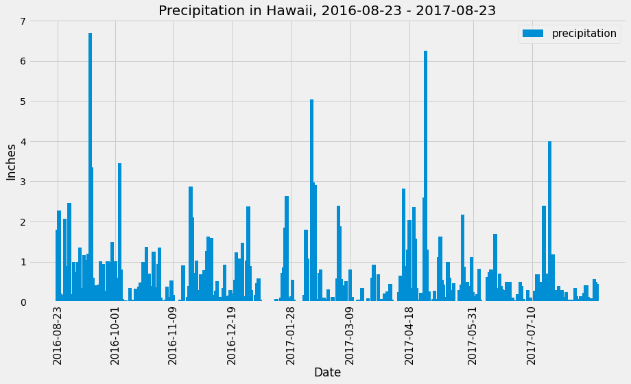
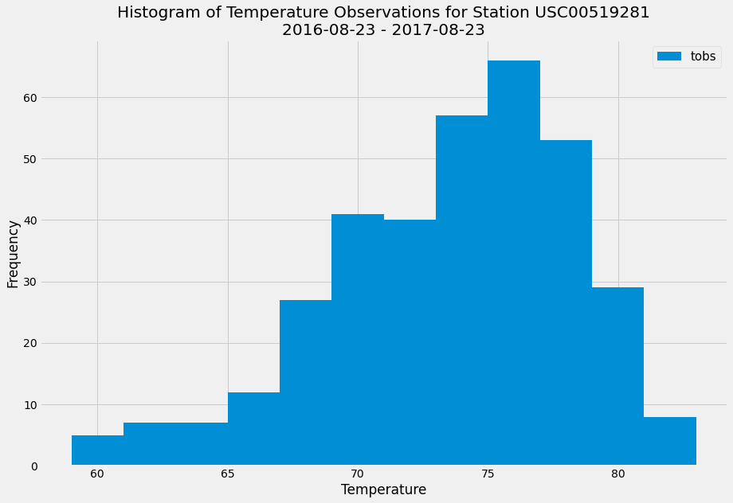
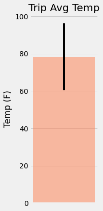
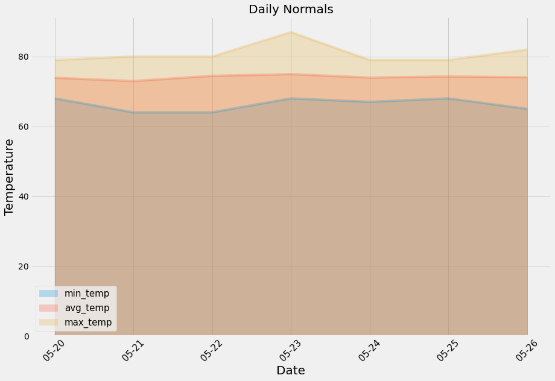

# SQLAlchemy - Surfs Up!

## Table of contents
  * [Introduction](#introduction)
  * [Climate Analysis and Exploration](#climate-analysis)
     * [Precipitation Anlaysis](#precipitation)
     * [Station Analysis](#station)
  * [Climate App](#climate-app)
  * [Other Analyses](#other-analyses)
      * [Temperature Analysis](#temperature)
      * [Daily Rainfall Average](#rainfall)
      * [Daily Temperature Average](#daily-temp)
      * [Temperature Analysis / t-test](#t-test)
  * [Technologies](#technologies)
  
##  Introduction
This repository was created to help with trip planning in Honolulu, Hawaii, with some climate analysis on the area. There will be a climate analysis, including precipitation analysis, station analysis. Also, a Flask API will be available. Lastly, other analyses, including temperature analysis, daily rainfall average, daily temperature analysis, and temperature analysis comparing between June and December, are available as well. 

## Step 1 - Climate Analysis and Exploration
The notebook displays the whole analysis is available in this link: [Analysis Notebook](climate.ipynb)

To begin, Python and SQLAlchemy were used to do basic climate analysis and data exploration of the climate database. 
All of the following analysis was completed using SQLAlchemy ORM queries, Pandas, and Matplotlib.

* [hawaii.sqlite](Resources/hawaii.sqlite) file was used to complete the climate analysis and data exploration.

* SQLAlchemy `create_engine` was used to connect to the sqlite database.

* USQLAlchemy `automap_base()` was used to reflect the tables into classes, and a reference to those classes called `Station` and `Measurement` was saved.

###  Precipitation Analysis

* A query was designed to retrieve the last 12 months of precipitation data.

* Only the `date` and `prcp` values were selected.

* Query results were loaded into a Pandas DataFrame, and the index was set to the date column.

* The DataFrame values were sorted by `date`.

* The results were plotted using the DataFrame `plot` method. The created plot is the following:

  
* Pandas was used to print the summary statistics for the precipitation data.

###  Station Analysis

* A query was designed to calculate the total number of stations and to find the most active stations.
  * The stations and observation counts were listed in descending order to find the most active stations, and the station has the highest number of observations using `func.min`, `func.max`, `func.avg`, and `func.count` in the queries.

* A query was to retrieve the last 12 months of temperature observation data (TOBS), and the data were filtered by the station with the highest number of observations.

  * The results were plotted as a histogram with `bins=12`. The created plot is the following:

    

- - -

## Step 2 - Climate App

After the initial analysis was completed, a Flask API was designed based on the queries just developed. 
The script is available here: [app.py](app.py)

### Routes
The routes were built by using Flask. The available routes in the app and descriptions are the following:

* `/`

  * Home page.

  * Lists all available routes.

* `/api/v1.0/precipitation`

  * Converts the query results to a dictionary using `date` as the key and `prcp` as the value.

  * Returns the JSON representation of your dictionary.

* `/api/v1.0/stations`

  * Returns a JSON list of stations from the dataset.

* `/api/v1.0/tobs`
  * Queries the dates and temperature observations of the most active station for the last year of data.
  
  * Returns a JSON list of temperature observations (TOBS) for the previous year.

* `/api/v1.0/<start>` and `/api/v1.0/<start>/<end>`

  * Returns a JSON list of the minimum temperature, the average temperature, and the max temperature for a given start or start-end range.

  * When given the start only, it calculates `TMIN`, `TAVG`, and `TMAX` for all dates greater than and equal to the start date.

  * When given the start and the end date, it calculates the `TMIN`, `TAVG`, and `TMAX` for dates between the start and end date inclusive.

- - -

## Other Analyses

### Temperature Analysis

* The notebook contains a function called `calc_temps` that will accept a start date and end date in the format `%Y-%m-%d`. The function will return the minimum, average, and maximum temperatures for that range of dates.

* The `calc_temps` function was to calculate the min, avg, and max temperatures for the trip using the matching dates from the previous year 
(i.e., use "2017-01-01" if your trip start date was "2018-01-01").

* The min, avg, and max temperature from the previous query were plotted as a bar chart.

  * the average temperature as the bar height.

  * the peak-to-peak (TMAX-TMIN) value as the y error bar (YERR).
  
  * The created plot is the following:

    

### Daily Rainfall Average

* The rainfall per weather station was calculated using the previous year's matching dates.

* The daily normals were calculated. Normals are the averages for the min, avg, and max temperatures.

### Daily Temperature Average

* A function called `daily_normals`  will calculate the daily normals for a specific date. This date string will be in the format `%m-%d`. All historic TOBS that match the date string were used.

* A list of dates for your trip in the format `%m-%d` was created. The `daily_normals` function was used to calculate the normals for each date string, and the results were appended to a list.

* The list of daily normals was loaded into a Pandas DataFrame and set the index equal to the date.

* Pandas was used to plot an area plot (`stacked=False`) for the daily normals. The created plot is the following:

  
 
### Temperature Analysis / t-test
 
* Hawaii is reputed to enjoy mild weather all year. This analysis is to see if there a meaningful difference between the temperature in, for example, June and December.

* SQLAlchemy was used to perform this portion.

* The average temperatures in June and December were identified at all stations across all available years in the dataset.

* A t-test is used to determine whether the difference in the means is statistically significant. The t-test is used to test the difference between means to determine if there is a significant difference between the two groups. A paired t-test compares the means of the related groups, and an unpaired t-test compares the means of different groups. A paired t-test is designed to compare the means of the same group or item in two separate scenarios. An unpaired t-test compares the means of two independent or unrelated groups.
In this case, comparing the means between the average temperature in June and December at the same places in Hawaii, ** a paired t-test** is more suitable to use as it is to compare the same places' temperatures at different times.
  
##  Technologies
Project is created with:
* SQLAlchemy
* Python 3.8
* Jupyter Notebook
* Flask
* Matplotlib
* Pandas
* datetime

