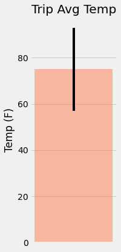

# SQLAlchemy-Surfs Up!

## Table of contents
  * [Introduction](#introduction)
  * [Climate Analysis and Exploration](#climate-analysis)
     * [Precipitation Anlaysis](#precipitation)
     * [Station Analysis](#station)
  * [Climate App](#climate-app)
  * [Other Analyses](#other-analyses)
      * [Temperature Analysis](#temperature)
      * [Daily Rainfall Average](#rainfall)
      * [Daily Temperature Average](#daily-temp)
      * [Temperature Analysis / t-test](#t-test)
  * [Technologies](#technologies)
  
##  Introduction
This repository was created to help with trip planning in Honolulu, Hawaii, with some climate analysis on the area. There will be a climate analysis inluding precipitation analysis, station analysis. Also, a Flask API will be available. Lastly, other analyses including temperature anlaysis, daily rainfall average, daily temperature analysis, and temperature anlaysis comparing between June and December are available as well. 

## Step 1 - Climate Analysis and Exploration
The notebook displays the whole analysis is available in this link: [Analysis Notebook](https://nbviewer.jupyter.org/github/SaraKim-sy/sqlalchemy-challenge/blob/main/.ipynb_checkpoints/climate-checkpoint.ipynb)

To begin, Python and SQLAlchemy were used to do basic climate analysis and data exploration of the climate database. 
All of the following analysis was completed using SQLAlchemy ORM queries, Pandas, and Matplotlib.

* [hawaii.sqlite](Resources/hawaii.sqlite) file was used to complete the climate analysis and data exploration.

* SQLAlchemy `create_engine` was used to connect to the sqlite database.

* USQLAlchemy `automap_base()` was used to reflect the tables into classes and a reference to those classes called `Station` and `Measurement` was saved.

###  Precipitation Analysis

* A query was designed to retrieve the last 12 months of precipitation data.

* Only the `date` and `prcp` values were selected.

* Query results were loaded into a Pandas DataFrame and the index was set to the date column.

* The DataFrame values were sorted by `date`.

* The results was plotted using the DataFrame `plot` method. The created plot is the following:

  
* Pandas was used to print the summary statistics for the precipitation data.

###  Station Analysis

* Design a query to calculate the total number of stations.

* Design a query to find the most active stations.

  * List the stations and observation counts in descending order.

  * Which station has the highest number of observations?

  * Hint: You will need to use a function such as `func.min`, `func.max`, `func.avg`, and `func.count` in your queries.

* Design a query to retrieve the last 12 months of temperature observation data (TOBS).

  * Filter by the station with the highest number of observations.

  * Plot the results as a histogram with `bins=12`.

    

- - -

## Step 2 - Climate App

Now that you have completed your initial analysis, design a Flask API based on the queries that you have just developed.

* Use Flask to create your routes.

### Routes

* `/`

  * Home page.

  * List all routes that are available.

* `/api/v1.0/precipitation`

  * Convert the query results to a dictionary using `date` as the key and `prcp` as the value.

  * Return the JSON representation of your dictionary.

* `/api/v1.0/stations`

  * Return a JSON list of stations from the dataset.

* `/api/v1.0/tobs`
  * Query the dates and temperature observations of the most active station for the last year of data.
  
  * Return a JSON list of temperature observations (TOBS) for the previous year.

* `/api/v1.0/<start>` and `/api/v1.0/<start>/<end>`

  * Return a JSON list of the minimum temperature, the average temperature, and the max temperature for a given start or start-end range.

  * When given the start only, calculate `TMIN`, `TAVG`, and `TMAX` for all dates greater than and equal to the start date.

  * When given the start and the end date, calculate the `TMIN`, `TAVG`, and `TMAX` for dates between the start and end date inclusive.

- - -

## Other Analyses
      * Temperature Analysis(#temperature)
      * Daily Rainfall Average(#rainfall)
      * Daily Temperature Average(#daily-temp)
      * Temperature Analysis / t-test(#t-test)
* The following are optional challenge queries. These are highly recommended to attempt, but not required for the homework.

### Temperature Analysis

* The starter notebook contains a function called `calc_temps` that will accept a start date and end date in the format `%Y-%m-%d`. The function will return the minimum, average, and maximum temperatures for that range of dates.

* Use the `calc_temps` function to calculate the min, avg, and max temperatures for your trip using the matching dates from the previous year (i.e., use "2017-01-01" if your trip start date was "2018-01-01").

* Plot the min, avg, and max temperature from your previous query as a bar chart.

  * Use the average temperature as the bar height.

  * Use the peak-to-peak (TMAX-TMIN) value as the y error bar (YERR).

    

### Daily Rainfall Average

* Calculate the rainfall per weather station using the previous year's matching dates.

* Calculate the daily normals. Normals are the averages for the min, avg, and max temperatures.

### Daily Temperature Average

* You are provided with a function called `daily_normals` that will calculate the daily normals for a specific date. This date string will be in the format `%m-%d`. Be sure to use all historic TOBS that match that date string.

* Create a list of dates for your trip in the format `%m-%d`. Use the `daily_normals` function to calculate the normals for each date string and append the results to a list.

* Load the list of daily normals into a Pandas DataFrame and set the index equal to the date.

* Use Pandas to plot an area plot (`stacked=False`) for the daily normals.

  
 
### Temperature Analysis / t-test
 
* Hawaii is reputed to enjoy mild weather all year. Is there a meaningful difference between the temperature in, for example, June and December?

* You may either use SQLAlchemy or pandas's `read_csv()` to perform this portion.

* Identify the average temperature in June at all stations across all available years in the dataset. Do the same for December temperature.

* Use the t-test to determine whether the difference in the means, if any, is statistically significant. Will you use a paired t-test, or an unpaired t-test? Why?
  
##  Technologies
Project is created with:
* SQLAlchemy
* Python 3.8
* Jupyter Notebook
* Flask
* Matplotlib
* Pandas
* datetime

